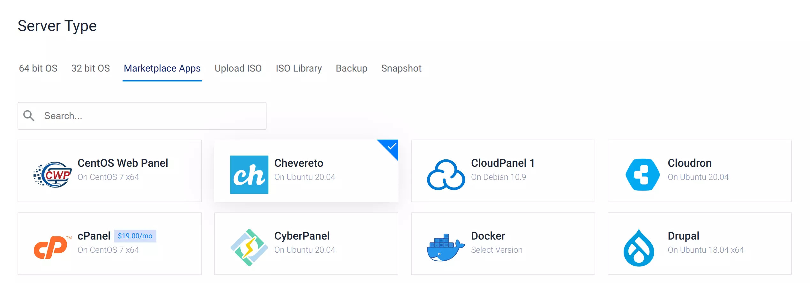

# Deploy Chevereto

Chevereto can be easily deployed on Vultr from the [Vultr Marketplace](https://vultr.grsm.io/chevereto) and if you use our Vultr links you get **$100 credit** to try Vultr services.

This provisioning is supported by us and you can check the [repository](https://github.com/chevereto/vultr-marketplace) we made for it.

::: tip All-included
This provisioning includes the following:

* Enables the UFW firewall to allow only SSH (port 22, rate limited), HTTP (port 80), and HTTPS (port 443) access.
* Sets up the Chevereto database and its user.
* Sets the MySQL root password.
* Sets up the debian-sys-maint user in MySQL so the system’s init scripts for MySQL will work without requiring the MySQL root user password.
* Sets the cron required for background tasks.
* Includes Certbot pre-installed.
:::

## Step-by-step guide

* Click the [deploy](https://vultr.grsm.io/chevereto) button

Chevereto is available under Server Type, **Marketplace Apps** when creating a new server.

* Configure your server as your needs
* That's all

::: tip Enable swap
If you setup a small machine ($5/mo) you should definitely [Add swap space](https://www.digitalocean.com/community/tutorials/how-to-add-swap-space-on-ubuntu-20-04).
:::
