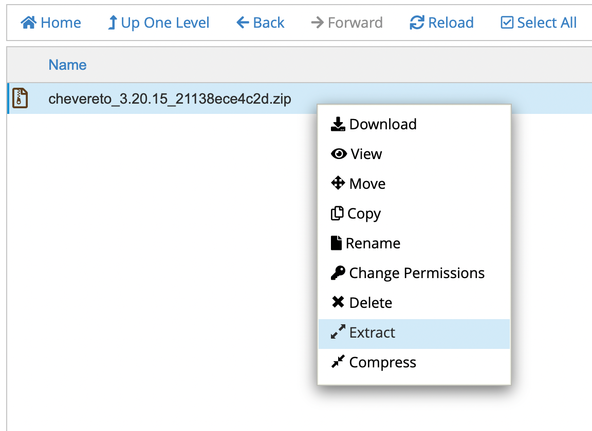
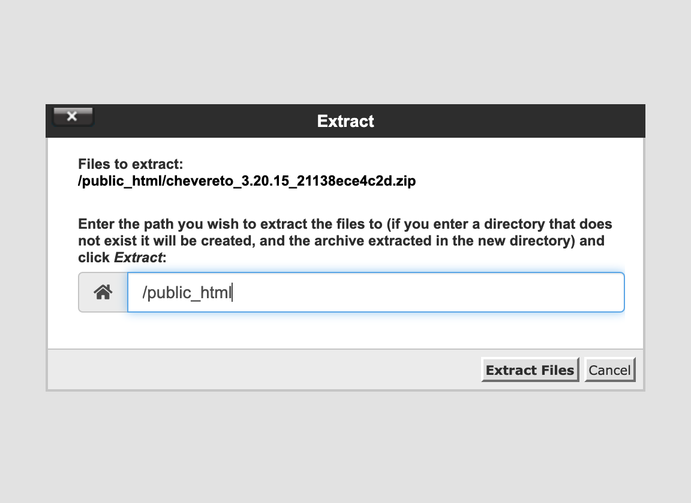
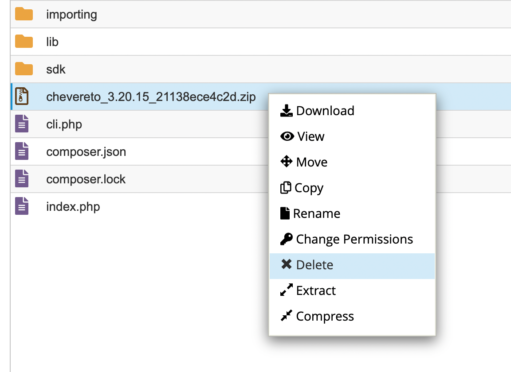
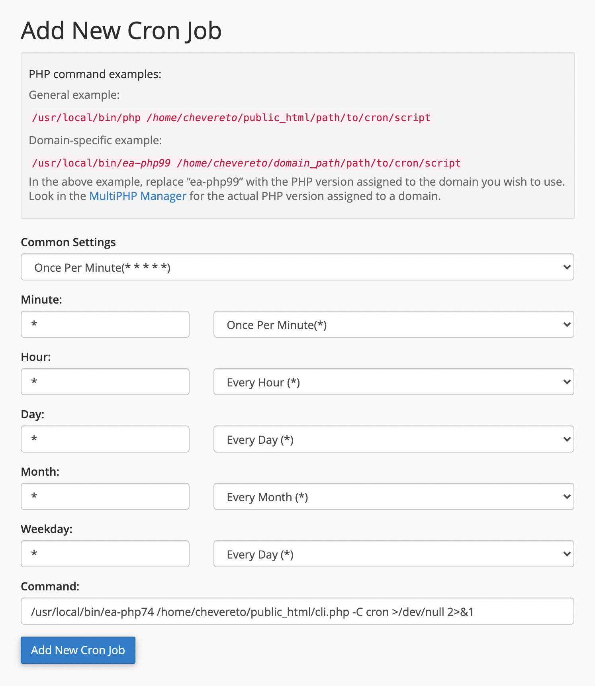

# cPanel

This guide will enable you to install Chevereto on cPanel from scratch.

## Database

Go to the **MySQL Database Wizard** under **Databases**.


Follow the process to create a database and its user. Take note on the MySQL **database name**, **username** and **password**.


Grant `ALL PRIVILEGES` on the newly created database and user.


## Chevereto Files

* Go to **File Manager** under **Files**.


* Navigate to your website `public_html/` directory.


* Click on **Upload** and on **Select File** upload the release zip file downloaded from [chevereto.com/panel/downloads](https://chevereto.com/panel/downloads)
* Once uploaded, go back to the file manager at `public_html/` directory.
* Right-click on the zip file file and select **Extract**.



* A prompt appears, click on **Extract Files**



* Delete the zip file when the extraction completes.



## PHP

Go to **MultiPHP INI Editor** under **Software**.


Select your website under **Configure PHP INI basic settings**.


Take note on the following configurable keys:


* `max_execution_time` 30
* `memory_limit` 256M (min)
* Use `post_max_size` and `upload_max_filesize` to limit the file upload max. size allowed for uploads

Go to **MultiPHP Manager** and select `PHP 7.4` for your website.


* From here you can also enable the [extensions required](requirements.md#php-extensions) by Chevereto.

::: danger PHP Extensions
Refer to the cPanel [PHP Extensions and Applications Package](https://docs.cpanel.net/whm/software/php-extensions-and-applications-package/) and WHM [How to install a PHP extension in WHM](https://support.cpanel.net/hc/en-us/articles/360050971633) documentation if your cPanel provisioning lacks the extensions required by Chevereto.
:::

## Install Chevereto

Go to `http://your_website/` and follow the instructions to the create the admin account.

## Setup Cron on cPanel

* Go to **Cron Jobs** under **Advanced**
* Scroll to **Add New Cron Job**



* Under **Common Settings** pick `Once Per Minute (* * * * *)`

The **Command** varies on each installation, you need to create your own command based on the following general form:

```sh
php-binary cli-path -C cron >/dev/null 2>&1
```

* **php-binary** Check the `PHP command examples` section under **Add New Cron Job** where you can learn about the PHP path for your system.
* **cli-path** The Chevereto CLI path can be found on your Dashboard panel under **Installation details**.

### Command examples

<code-group>
<code-block title="General">
```sh
/usr/local/bin/ea-php74 /home/chevereto/public_html/cli.php -C cron >/dev/null 2>&1
```
</code-block>

<code-block title="CloudLinux">
```sh
/opt/alt/php74/usr/bin/php /home/chevereto/public_html/cli.php -C cron >/dev/null 2>&1
```
</code-block>
</code-group>

## Setup Email

* Refer to: [Setup Email](../../manual/first-steps/setup-email.md)
