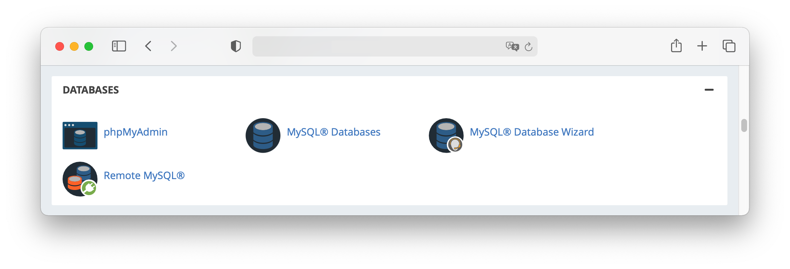
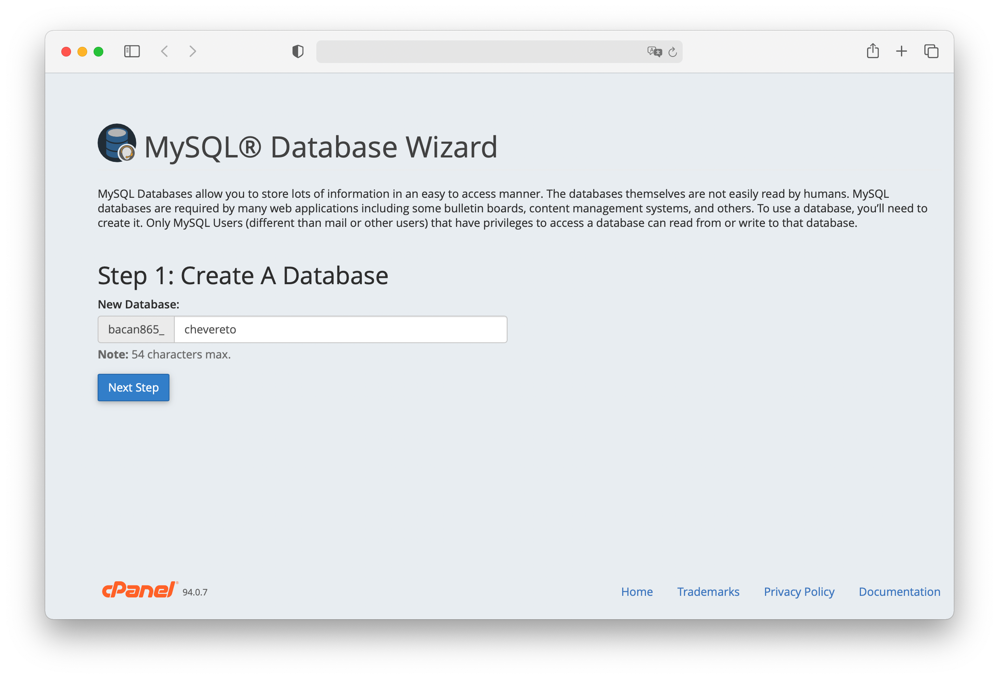
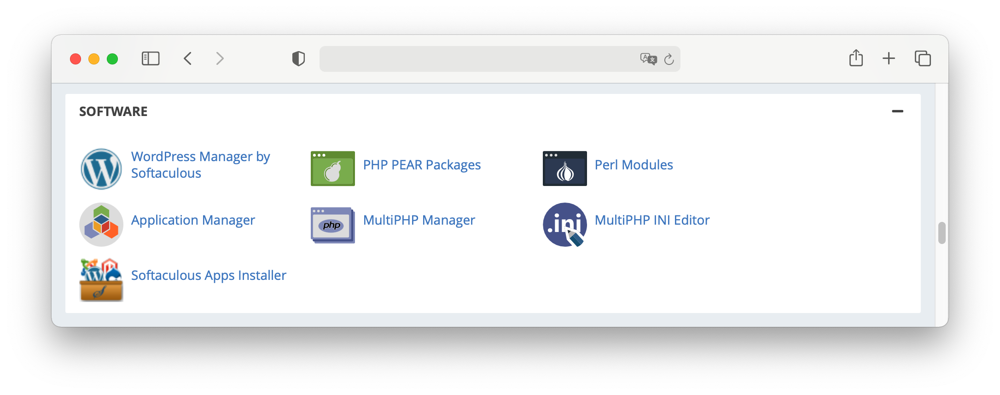
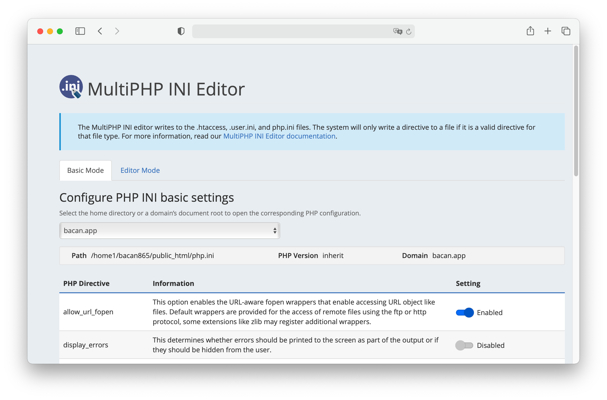
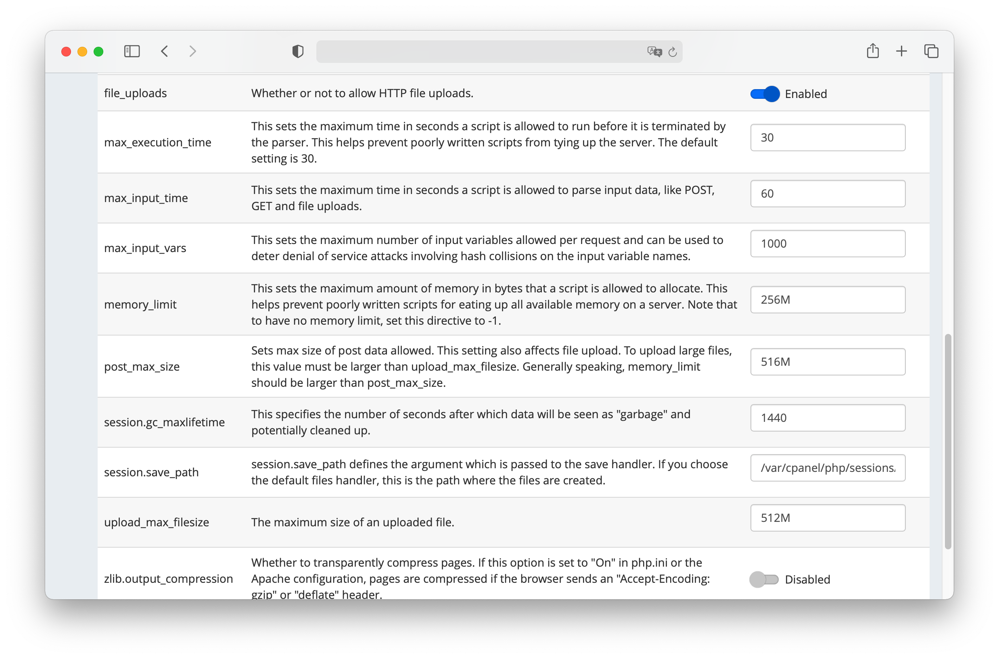
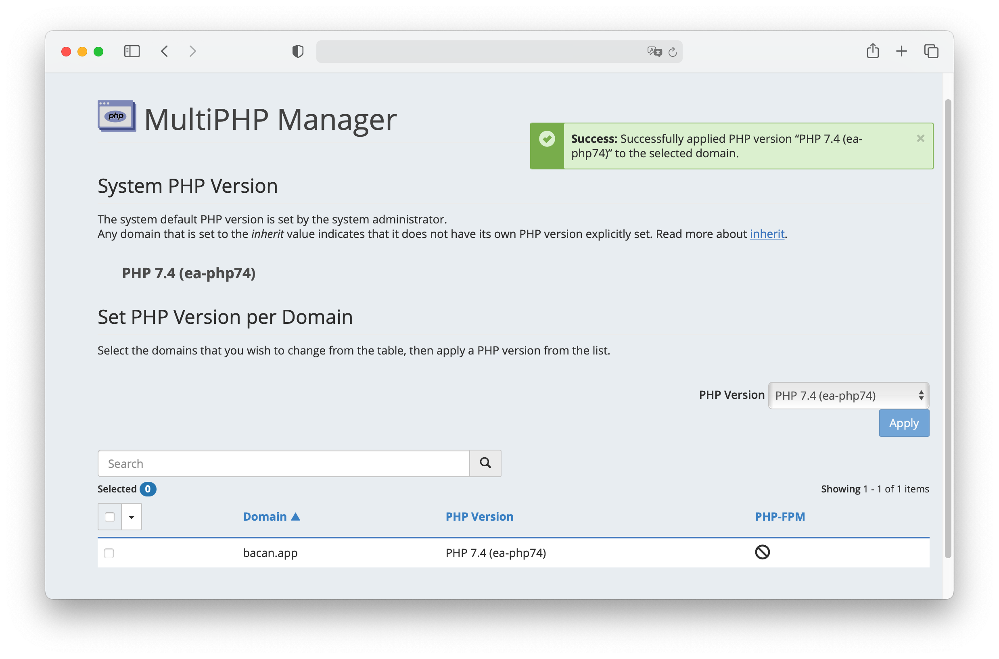
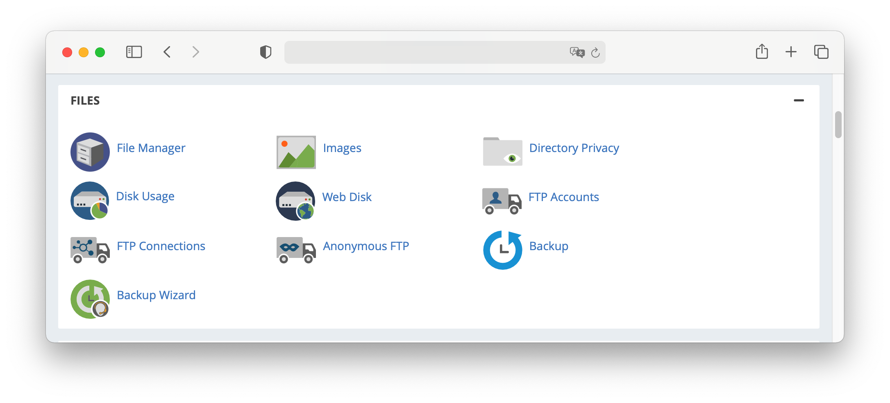
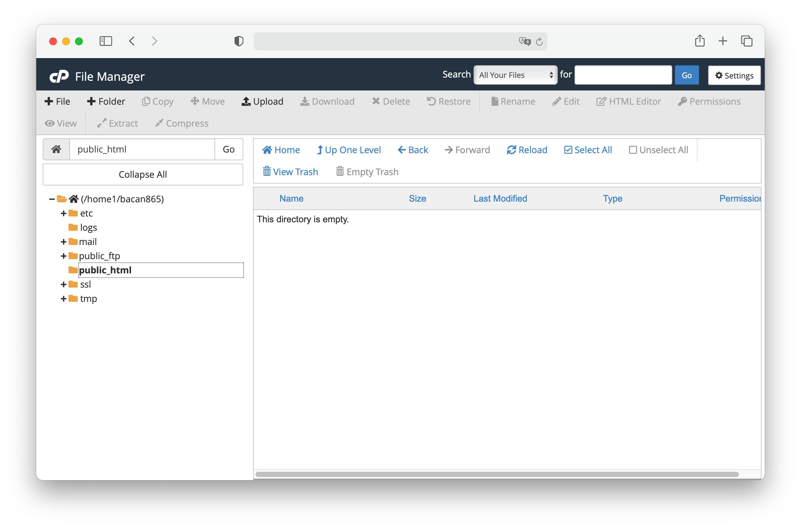
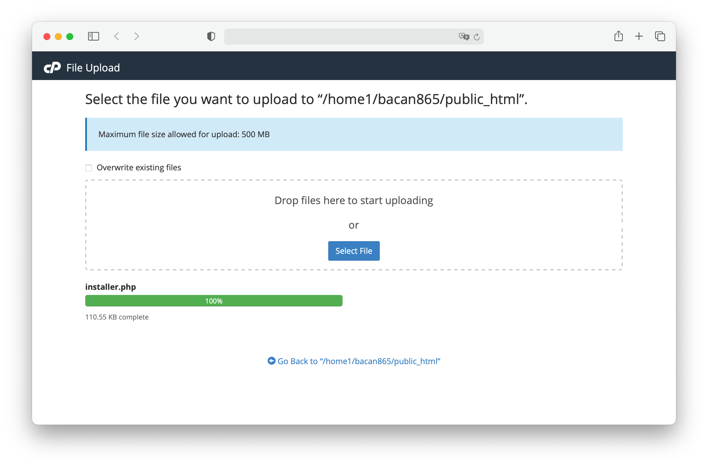

# cPanel

This guide will enable you to install Chevereto on cPanel from scratch.

## Database

Go to the **MySQL Database Wizard** under **Databases**.

Follow the process to create a database and its user. Take note on the MySQL **database name**, **username** and **password**.

Grant `ALL PRIVILEGES` on the newly created database and user.

## PHP

Go to **MultiPHP INI Editor** under **Software**.

Select your website under **Configure PHP INI basic settings**.

Take note on the following configurable keys:

* `max_execution_time` 30
* `memory_limit` 256M (min)
* Use `post_max_size` and `upload_max_filesize` to limit the file upload max. size allowed for uploads

Go to **MultiPHP Manager** and select `PHP 7.4` for your website.

* From here you can also enable the [extensions required](requirements.md#php-extensions) by Chevereto.

::: danger PHP Extensions
Refer to the cPanel [PHP Extensions and Applications Package](https://docs.cpanel.net/whm/software/php-extensions-and-applications-package/) and WHM [How to install a PHP extension in WHM](https://support.cpanel.net/hc/en-us/articles/360050971633) documentation if your cPanel provisioning lacks the extensions required by Chevereto.
:::

## Files

Go to **File Manager** under **Files**.

Navigate to your website `public_html` directory.

Click on **Upload** and **Select File** [installer.php](https://chevereto.com/download/file/installer)

## Install Chevereto

Go to `http://your_website/installer.php` and follow the [Installer instructions](https://github.com/chevereto/installer/blob/master/HTTP.md).
